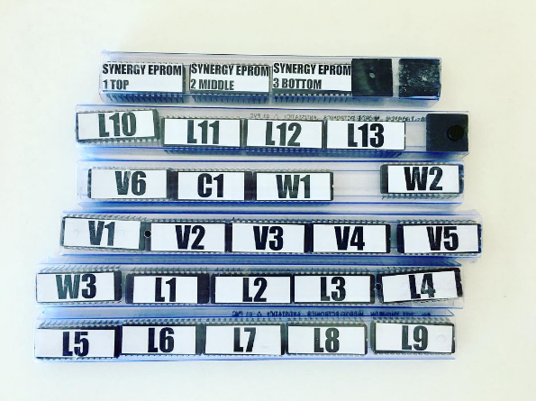
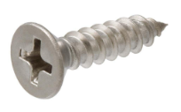

[< BACK](readme.md)

#Synergy Cartridge

I have a complete set of all of the EPROMs for the Synergy - including all of the cartridges. I'd like to fit these into actual cartridges to have along side my Synergy (as opposed to using some sort of socket adapter or a multi-cartridge device). 

	I know what you are thinking. Yes, these are also available using SYNHCS on the Kaypro II (they are all archived on the collection of voice disks that I have), but I wanted to have a full set of cartridges to go with it so I don't have to always boot up the Kaypro II.

According to Dan Wilson of Hideaway Studio, the Synergy uses cartridge bodies and PCBs that are compatible with the vintage Atari 400 computer game console. In my cursory research, this seems to be the case.  If I had just a few cartridges to do I could eBay a handful of cartridges, mod the PCB and be off to the races.

As I have 23 cartridges to make (and enjoy a good challenge), I decided to 3D print my own custom case (based off a vintage Synergy voice cartridge) and replicate the PCB in Eagle.

##MY PLAN:

* Design a new Cartridge Body in OpenSCAD [*DONE*]
* 3D Print 23 Cases [*In-Process*]
* Replicate the PCB in Eagle [*DONE*]
* Do a Test Run of the PCB at OSH Park [*In-Process*]
* Assemble, Test and Tweak the PCB
* Find and Affordable PCB Manufacturer that can Gold Plate the Edges
* Get >23 PCBs Made with Gold Plated Edges
* Assemble All Carts

##3D PRINTED CARTRIDGE BODY

The cart body is in two parts - the top and the bottom. While it is close to the original, I've made some modifications to better support 3D printing. Primarily, there are now 5 little plastic studs in the four corners and top center to make the body way more rigid (the original only had one in the top center location). I also changed the label system to use a single 0.5" x 1.75" mailing label on the top end (as opposed to the wraparound label.

You are welcome to grab the STL and/or OpenSCAD files to play around with it. I've been printing on my NewMatter Mod-T with PLA. If you are using a different printer, the tolerances may be different. Let me know if you have any issues.

* [Top STL File](scad/synergycart-top.stl)
* [Bottom STL File](scad/synergycart-bottom.stl)
* [OpenSCAD File](scad/synergycart.scad)

The cartridge is designed to support a standard 0.5" x 1.75" mailing label on the end; I ordered this product from Amazon to laser print my labels:

[Avery Easy Peel Return Address Labels for Laser Printers, 0.5 x 1.75 Inches, White, Pack of 2000 (5267)](https://www.amazon.com/gp/product/B00004Z5QP)

You will also need a 1/2 inch #6 wood screw (0.138" major thread diameter and .279" head diameter) with a crown top for each cartridge.

##CARTRIDGE PCB

As opposed to using the Atari 400 cartridge PCB (there is a schematic in the Additional Resources if you are curious), I decided to take apart a Synergy Cartridge and reverse engineer it with a voltmeter and high-precision calipers. I then replicated it in Eagle. Why? Cuz it was fun. ;)

Here are the rendered test PCBs from OSH Park:

####EEPROM Pin Mapping

Here are some notes I made during the process:

| Top Edge | EEPROM Pin |  | Bottom Edge | EEPROM Pin |
| --- | --- | --- | --- | --- |
| T1 | 1 | | B1 | X |
| T2 | 7 | | B2 | 27 |
| T3 | 8 | | B3 | 21 |
| T4 | 9 | | B4 | 23 |
| T5 | 10 | | B5 | 19 |
| T6 | 16 | | B6 | 15 |
| T7 | 17 | | B7 | 2 |
| T8 | 13 | | B8 | 24 |
| T9 | 12 | | B9 | 25 |
| T10 | 11 | | B10 | 3 |
| T11 | 18 | | B11 | 4 |
| T12 | 22 | | B12 | 5 |
| T13 | 26/28 | | B13 | 6 |
| T14 | 26/28 | | B14 | 14/20 |
| T15 | X | | B15 | 14/20 |

There is also a through-hole resistor (4k7), capacitor (.1uf) and diode on the original cartridge. You can find my reverse-engineered schematic below that shows where to place these:

I'll post the Eagle Files and Gerbers here once it is tested and working.

Finally, there is a link to the EEPROM data sheet in the Additional Resources section below.

##ADDITIONAL RESOURCES

* [AM2764DC EEPROM Datasheet](scad/AM2764DC.pdf)
* [PDF for Atari 400 PCB](http://www.grandideastudio.com/wp-content/uploads/pp_atari8bit_instructions.pdf) from Grand Idea Studio (not used)
* [Page with Link to Gerbers File](http://www.grandideastudio.com/portfolio/pixels-past/) from Grand Idea Studio (not used)
* Original PCB Top: 
* Original PCB Bottom: 
