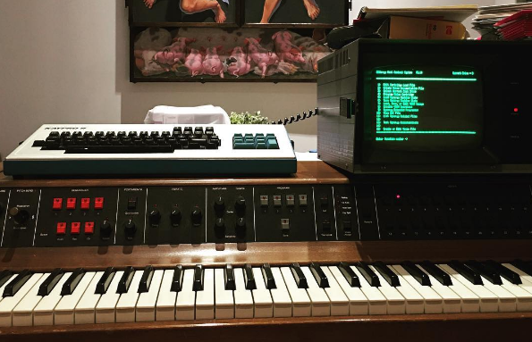
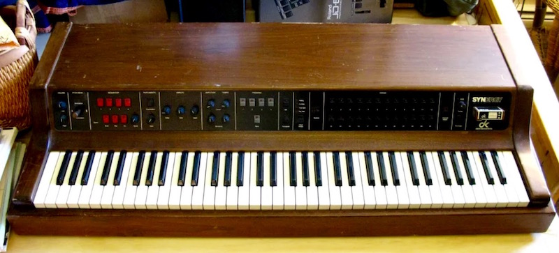
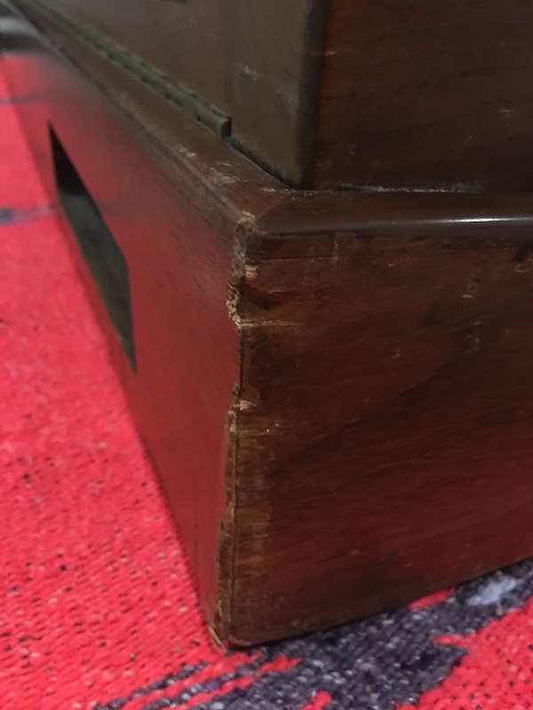
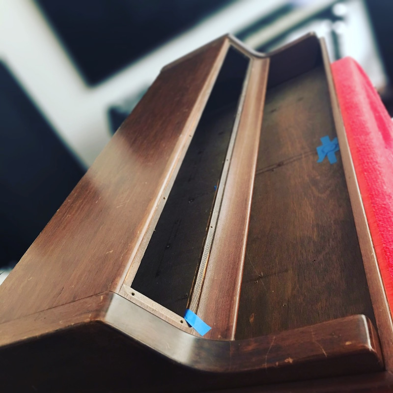

[< BACK](readme.md)

# Restoring the Wood Case

##Context and a Plan

So - my Synergy is currently a medium-brown wood. It has some damage, but isn't horrible. Basic scratches and light gouges around the body. Only one place on the primary face where a little of the surface is chipped off. Each of the four corners of the base is crushed in a bit.

My analysis is that this is what an upright piano looks like after a few moves in a family with toddlers. Rather than try to fix it myself, I'm looking for a piano refinisher in the LA area to fix it as I have no experience restoring wood with this type of damage.  I figure they would be the best with this kind of problem - especially since the body of the Synergy is like a big piece of wood furniture (like a piano).

Here is what it looked like when I purchased it:

Note the damage to the corners of the base (all four are similar):

The fact that I've decided to bring in a professional refinisher opens up the question as to whether I'm going to keep the brown wood or do something else.

*Calm down, I'm not doing the Murf and the Magic Tones pink fur treatment. Though - you have to admit it would be awesome. :)*

I'm actually considering refinishing it in a black lacquer piano finish. Something like this:

Crossed with this:

Should look beautiful. Couple of points:

* The ends of my brown Synergy are shaped a little differently and I'm not planning to change that. 
* The black Synergy keyboards that I've seen have a tolex-wrapped base. As I don't plan to travel with the instrument, if I piano-black the thing, I'll probably just do the whole body.

##Results

It turned out amazingly well. Total for the case refurbishment (repair and refinishing) was around $1300 in LA. Considering how banged up it was, they did a wonderful job.

Check out some early pictures:

