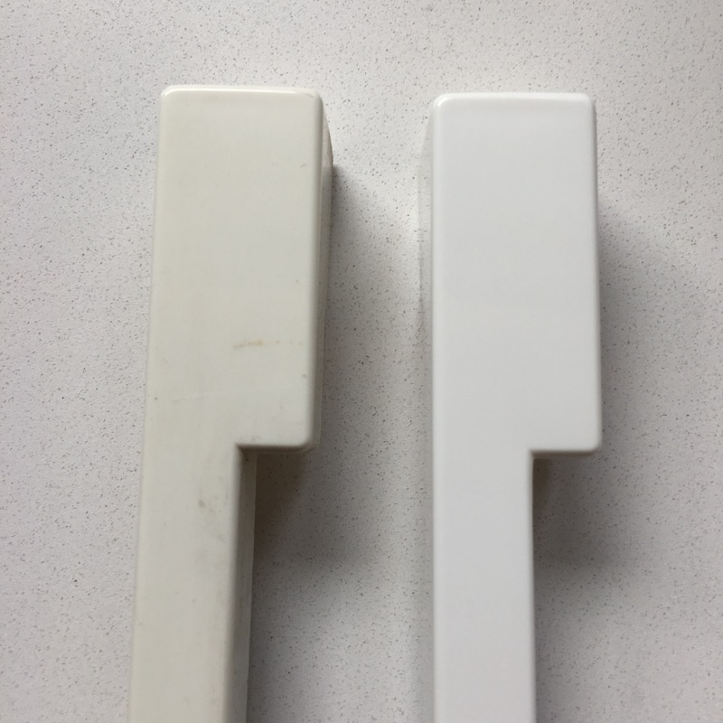
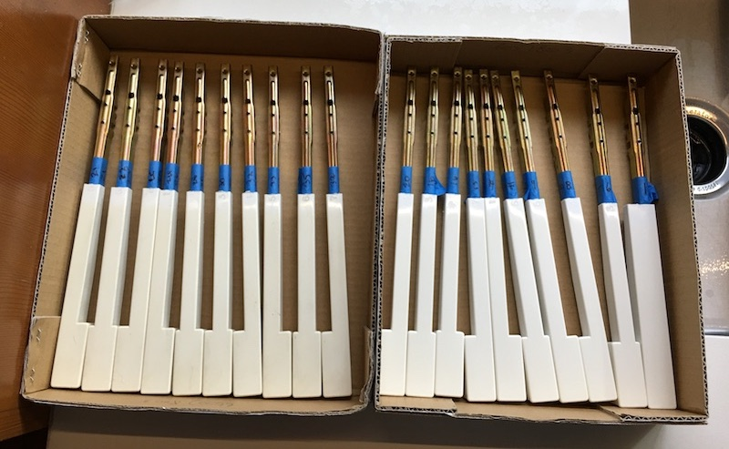
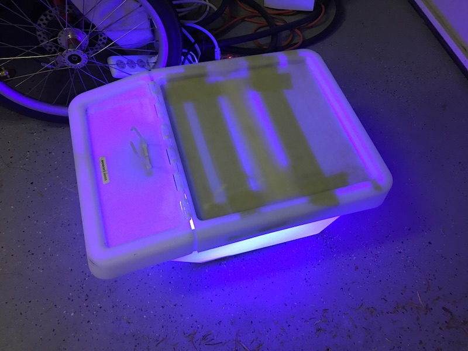
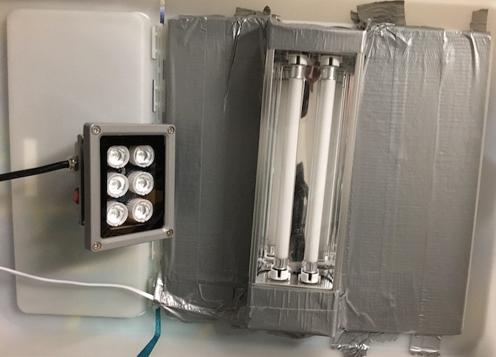
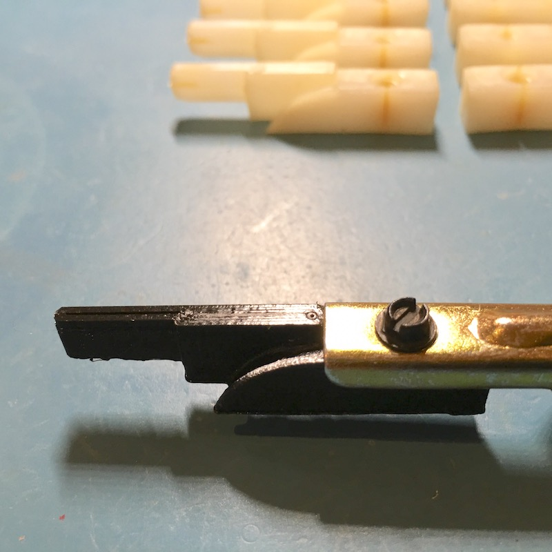
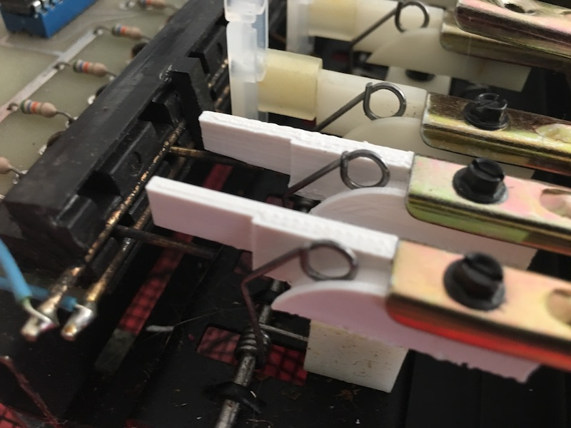
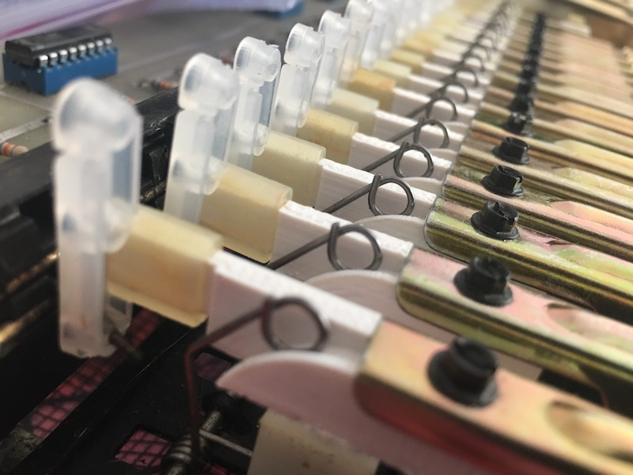

[< BACK](readme.md)

#Keyboard Refurbishment

This section covers my refurbishment of the DK Synergy Keyboard. You will find details on removing the keys, cleaning/whitening, 3D printing actuator replacements, replacing the rubber bushings, and reinstalling the keys.

##On the Universal Keyboard Upgrade

There is a "universal keyboard upgrade" that you can find on the [Virtual Music site](http://virtual-music.at/webseiten_e/zubehoer/dk.htm). I reached out to Alexander Guelfenberg at Virtual Music about getting his upgrade and found it wasn't offered for the Synergy anymore. Here is what he shared with me:

	All items were fitting when I had my personal Synergy. And I saw that all PPG parts worked for that. 
	But then a client told me that his knobs are quite different so they did not fit.

I should point out that he is an insanely nice person and has been extremely helpful with my Synergy work.

##Removing Keys

Removing the keys from the Pratt-Read assembly is pretty straightforward. Screws in my Synergy Keyboard were easily managed using a 5/32" socket wrench. This was a little hard to find at my local Home Depot, it literally was the smallest socket that they had (and there was only one of them in stock).

I went ahead and labeled all of my keys with blue tape up on the metal bit. They are labeled themselves as to which location they fit, but in order to avoid having keys placed in different octaves than their original source, I took the OCD way out. I figured if the wear and yellowing was uneven across the keyboard, making sure that they keys were put back in their original octave would keep things looking as uniform as possible. Thus, I haven't documented the factory labeling scheme for the keys.

What I did learn quickly is that all white keys need to be removed from around any of the black keys for disassembly and the reverse for reassembly. Due to this (and due to the fact that my cleaning procedures are different for white vs. black keys), I removed all of the white keys first and then followed it up with the black keys.

My steps for removal of the keys:

1. Remove the screw at the fulcrum point (middle of the metal key bar).
2. Remove the metal side spring by gently lifting it off of the plastic actuator and releasing it to the side of the key.
3. Lift the key up by the back and, when released, slide the key forward. (The little metal spring that inserts into the back of the actuator will simply pop out.)
4. Carefully remove the rear screw that holds the actuator in place.
5. Slide the back dingus off of the actuator. Sorry - I don't know what else to call it. It is the plastic bit that sticks up and has a few holes on it. It connects to the actuator using a rubbery ring.

That's it.

    Note: I wasn't able to figure out how to separate the white plastic key from the metal bar safely. 
    I decided to leave it on and be very careful during the cleaning.

##Cleaning the Keys

I followed a procedure that I found here:

http://www.retrofixes.com/2013/10/how-to-clean-whiten-yellowed-plastics.html

*It is highly recommended to use eye protection and operate in a well-ventilated area.*

####White Keys

Check out the difference before and after cleaning:

Left group hasn't been done; right group has:

**The Procedure:**

1. Wash the oil and filth off of the keys using an OxiClean + Water solution and a toothbrush. (Due to the fact that I could not remove the metal bits from the keys, I did not go through a soaking process.)
2. Liberally apply a hydrogen peroxide 12% solution (the Clairol Hair Color product below) to the plastic part of the key - careful to keep it off of the metal.
3. Place the keys under a strong UV light for 3-4 hours.
4. Immediately remove the keys, clean them with water, reapply the peroxide solution, and return them to the "UV bath" for another 3-4 hours.
5. Remove the keys, clean them with water and dry them.

Depending on the desired whiteness, I imagine that several more trips to the UV bath could be done. I elected to be conservative with my whiteness levels.

My homemade UV tank:

I used two UV lamps I found on Amazon (and liberal amounts of duct tape):

    IMPORTANT: At no point do you want the peroxide to dry as it can scar the plastic surface of the keys. 
    Set an alarm or other timer. These things are irreplaceable as far as I can tell.

####Black Keys

I simply washed the keys using the OxiClean + Water Solution using a toothbrush. They cleaned up nicely.

##Key Actuators

I first cleaned the actuators with rubbing alcohol wipes as they were covered in a sticky substance. Yuk.

I found ten plastic actuators in my Synergy that were cracked or cracking. All of the damage was found at the joint where the screw enters the body of the actuator. The sticky substance was an aid in this as it helped find the cracked actuators by making the cracks stand out.

To solve this, I modeled and 3D printed replacements for the failing parts. I tried printing in both PLA and ABS and found that ABS was far superior in producing a part that worked mechanically. The PLA would start sticking after only a few keypresses; I have yet to replicate that behavior with the ABS printed parts. There are more abrasion-resistant 3D filaments - I have yet to test any of them.

Here are the files for the replacement actuator:

* [Download the OpenSCAD Model](actuator/actuator.scad)
* [Download the STL Part File](actuator/actuator.stl)

These files are released under the [cc-by-sa-3](https://creativecommons.org/licenses/by-sa/3.0/us/) license. Hopefully you find it helpful!

##Rubber Bushings

If you need new Rubber Key Bushings for the Pratt-Read keyboard assembly, Syntaur has them.

[Syntaur Link for Pratt-Read Rubber Bushings](http://syntaur.com/Items/4169.html)

The Synergy has 74 keys and, thus, needs 74 bushings for a total replacement. At the time of this writing, they were $0.70 USD per bushing.

I grabbed a full set. After inspecting my bushings, I realized that they were still doing pretty well. Rather than throwing them away, I went ahead and conditioned them with Armor All Original Protectant and reinstalled them. I'll keep the new ones for a rainy day.

*Using Armor All is the recommended treatment that I found for the rubber bits in the Keyboard.*

##Reassembly

Reassembly is simply the reverse of the removal process. Remember, do the BLACK KEYS first to make it easy on yourself.

1. Attach the actuator back to the far end of the metal key body. Careful not to over-tighten the screw.
2. Attach the dingus to the end of the actuator. I recommend treating the rubbery ring with a coating of Armor All prior to reattachment.
3. Slide the plastic end of the key under the lip at the front of the assembly.
4. Press the key down onto the white plastic fulcrum; you might need to make sure that the part that it attaches to is properly centered for easy reattachment.
5. Using some sort of clever implement (I used a pair of SMD tweezers), pull the metal spring up and back over the curved area of the actuator.
6. Reattach the screw at the fulcrum point. Again, careful not to over-tighten it.
7. Carefully manipulate the spring at the far end of the key back into the appropriate hole in the dingus. I was able to pull the spring back in a bit from the other side of the black metal bar so as to realign it with the hole.

##Products Used

* [OxiClean at Amazon](https://www.amazon.com/gp/product/B005GI8UOO/ref=oh_aui_search_detailpage?ie=UTF8&psc=1)
* [Clairol Professional Soy4plex Pure White Creme Hair Color Developer at Amazon](https://www.amazon.com/gp/product/B00A5ET16A/ref=oh_aui_search_detailpage?ie=UTF8&psc=1)
* General Cheap Toothbrushes (drugstore brand); I used a motorized one in addition to a few plain ones for extra fun.
* [6-LED UV Lamp for Curing LOCA UV GLUE - 110V at Amazon](https://www.amazon.com/gp/product/B0178KPN4W/ref=oh_aui_search_detailpage?ie=UTF8&psc=1)
* [HQMaster 110V 48W Curing UV Light Ultraviolet Lamp to Bake Loca Glue for Refurbish LCD no Handle at Amazon
](https://www.amazon.com/gp/product/B012ZNLZY4/ref=oh_aui_search_detailpage?ie=UTF8&psc=1)
* [Armor All 10228 Original Protectant at Amazon](https://www.amazon.com/Armor-All-10228-Original-Protectant/dp/B0007898UI)

##Research

I found these videos for Pratt-Read Keyboards - though the assemblies do not match the Synergy.

* [ARP Pro Pratt-Read Keyboard Restoration](https://www.youtube.com/watch?v=5iJtaW3bvK4)
* [Pratt-Read Key Removal on OB-Xa](https://www.youtube.com/watch?v=DmSz_JY4zZU)
* [Pratt-Read Keyboard Restoration Video](https://www.youtube.com/watch?v=VvMh64XNhEw)

##License for Original Materials

The original materials made available on this page are licensed under the [cc-by-sa-3](https://creativecommons.org/licenses/by-sa/3.0/us/) license.