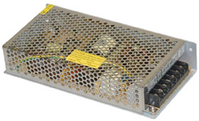

#Power Supply Upgrade

The following power supply was recommended to me for the Synergy (it has been tested and used with several refurbishments):

**Hengfu HF-100W-SF5**

* Output: 5V/20A
* RIP/Noise: 100mv
* Eff: 78%

[High-Level Data Sheet](https://www.mpja.com/catalog/Hengfu%20Power%20Supplies.pdf)

[Purchase Link from MPJA](http://www.mpja.com/5-Volt-Power-Supply-20A-100W-Switching-Hengfu/productinfo/16011+PS/)