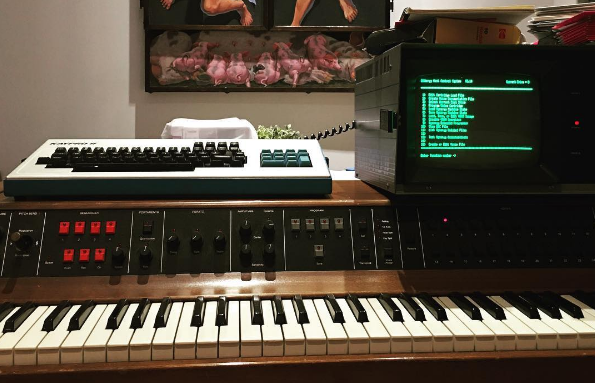

#bpcmusic's dk synergy corner

I'm creating this archive as a place to document my attempts to restore a DK Synergy II+ (#1398) that was purchased in the fall of 2016 as a part of my #midlifesynthcrisis or #midilifecrisis. :) I'll also be sharing a lot of photos on [my personal Instagram](http://instagram.com/bpcmusic).

Along the way, I'll store the relevant things that I learn here. While I am relatively handy with electronics, this is the first vintage synth project that I've undertaken. 

##My Journey

* [Taking the Synergy Apart](teardown.md)
* [Replacing the Aging Capacitors](capacitors.md)
* Installing Headers for Board Connections
* [Restoring the Wood Case](case.md)
* [Replacing the Power Supply and Noisy Fan](powersupply.md)
* [Fixing Sticky Buttons](stickybuttons.md)
* [Connecting to the Kaypro II](kaypro.md)
* Replacing the Kaypro II Disk Drive with a Floppy Emulator
* Building a Cartridge PCB and 3D Printed Shell

##Handy Resources

* [Synergy Resource Page](http://users.ece.gatech.edu/lanterma/synergy/)
* [Facebook Synergy Group](https://www.facebook.com/groups/synergysynth/)
* [Yahoo Synergy Group](https://groups.yahoo.com/neo/groups/synergy-synth/info)
* [Vintage Synth](http://www.vintagesynth.com/misc/synergy.php)
* [Old Crow's Vintage Synth Tips](http://www.oldcrows.net/~oldcrow/synth/tips.txt)
* [HxC Floppy Emulator](http://hxc2001.free.fr/floppy_drive_emulator/)
* [Syntaur Synergy Parts](https://syntaur.com/synergy.html)

##Synergy Videos

* Rex Coggins has compiled a YouTube playlist that covers a whole bunch of Synergy-related videos up on YouTube; check it out at [https://www.youtube.com/playlist?list=PLffUjChiMD5i-BCu7Go9ABLnsAaPviy90](https://www.youtube.com/playlist?list=PLffUjChiMD5i-BCu7Go9ABLnsAaPviy90) 

##Nice Helpful Folks

* Major thanks to **Brian McLaren** (made a few of those YouTube videos up there). He has gone above and beyond with me helping get the instrument 100% with my software, EPROMs and general usage questions.
* Thanks to **Rex Coggins** for his advice and recommendations.