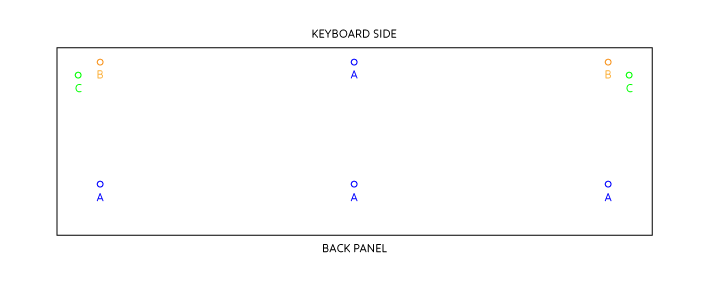

#Taking Apart the Synergy

Followed the instructions in the "DK-1 Operating System V 2.42 - Installation" document for the diassembly; presenting a shortened version here with a little more detail on the things that I did during the process.

####1. OPENING THE CASE

1. Balance the Synergy on its Back Panel - always hold carefully with one hand. It doesn't feel like it wants to stand there on its own.
2. Using a #3 screwdriver - remove the 4 screws marked "A"
3. Place the Synergy bottom-down and slightly overhang the keyboard over the edge of your workspace
4. Come under the Synergy and using a #3 screwdriver, remove the two screws marked "B"
5. Using a #2 screwdriver, remove the two screws marked "C"
6. *Do not do anything crazy after this point like tilting the Synergy - the keyboard is completely unsecured (except for a fragile little ribbon connector)*
7. Gently lift the top of the Synergy (above the Keyboard) using the two end blocks on either side of the keyboard.

####2. REMOVING THE KEYBOARD

1. Remove the ribbon connector from the upper right of the keyboard; do it carefully and "DO NOT PULL ON THE WIRE" (quoting the aforementioned document). It suggests using a flathead screwdriver - I used needlenose pliers.
2. Get a helper to hold the top of your Synergy - in the next step you remove the keyboard assembly, which causes a lot of weight to leave the base of the keyboard. Mine wanted to tip over - hence the helper.
3. Put a few things adjacent to the boards in the base of your Synergy to balance the weight with the top. I used 10 lbs of padded hand weights way at the front - which was just about enough.

####3. REMOVING THE BOARDS

Time to remove the three main boards from the inside of the Synergy. Before you start, load up on some anti-static bags. [12x16 Anti-Static Bags at Amazon](https://www.amazon.com/gp/product/B016WRZ3JW).

Here are the boards.

Left | Center | Right
--- | --- | ---
D/A Board | Voice Board | Processor Board + RS232 and Programming Daughterboards

1. Mark and Label Everything - there are a lot of wires *everywhere*.
2. Take a lot of photos. 
3. Take a few more photos. ;)
4. Get some big anti-static bags to store your boards; the largest ones I was able to find we 12x16 and didn't quite fit the two larger boards. By cutting down one side I was able to use two bags to contain each board.
5. Disconnect all of your labeled wiring from the three boards. Again - do not pull on the ribbons, use pliers and a flathead screwdriver to carefully remove them.
6. Remove the rubber bumpers that hold the boards in place one board at a time - carefully placing the boards into antistatic bags along the way. I went left to right.

####4. DISCONNECTING THE DAUGHTERBOARDS

Was able to carefully remove the smaller of the two (the RS232 board); the EEPROM board is pretty snug for me. Going to put that on hold until I get to the header installation.

####5. REMOVING THE MIDI ASSEMBLY

Remove the six screws from the MIDI panel and store the whole assembly away.

####6. REMOVING THE POWER SUPPLY

The power supply is held into the body of the Synergy by the screws on the back of the chassis - for of these screws hold the Synergy nameplate in place. I removed them while the case was open so that gravity kept the power supply box in place. To be safe, I also put a bunch of foam in the now empty Synergy body to catch the thing if it slides down while being removed.

####7. FRONT PANEL

1. Remove all of the knobs from their shafts on the front panel.
2. Remove all of the screws around the back of the panel that come through the wood body. Then wonder why you can't pop the whole thing out. But, don't try. Bad things will happen.
3. Remove the hanging daughterboard by removing the spacer screws (there are 13). Remove all but the outside ones first, then remove the end ones while carefully supporting the board. The headers in the middle will disconnect easily.
4. Wrap up that daughterboard in an anti-static bag.
5. Take some photos of the spacer pattern - don't want to forget it.
6. Remove the right circuit board by removing spacers and then the remaining screws. Careful to cradle it when you are down to the last two outside ones. Then, get that thing in an anti-static bag. I had to cut one in half to cover both sides of the thing.
7. Remove the left circuit board by removing the spacers and then the remaining screws. Cradle it when you are down to the last two outside ones - and don't forget to carefully disconnect the wire that is coming from the area of the joystick and potentiometers.
8. Remove the two nuts that hold the joystick in place, then remove the ground wire and then the final nut. Remove the joystick. Mark the top and store it away.
9. Remove the two potentiometers by unscrewing the nuts that are on the front of the potentiometers.

####8. Misc.

1. Finish up by removing the vent grill (noting its orientation).
2. Check that the washers that sat under the keyboard assembly aren't loose - four of mine were.

